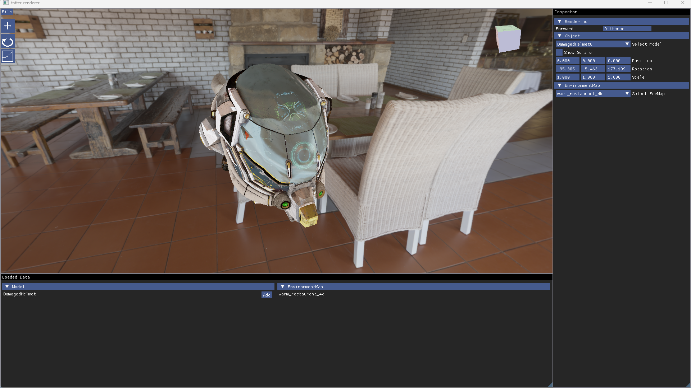

# tatter-renderer
Tatter Renderer is a real-time physically based renderer build with Vulkan.



## Requirements
- Windows 11
- MSVC (cl.exe)
- CMake

## Features
- [x] Forward rendering
- [x] Deferred rendering
- [x] glTF 2.0
	- [x] mesh
	- [x] standard material
- [x] PBR
- [x] IBL
	- [x] Diffuse prefiltering
	- [x] specular prefiltering


## In progress
- Linux support
- Android support
- Ray tracing

## Build
```bash

# NOTE : Make sure you can use cl.exe from command line.

git clone --recurse-submodules https://github.com/keigo-miyashita/tatter-renderer.git

cd tatter-renderer
cmake --preset win-x64-Debug/Release
cmake --build --preset win-x64-Debug/Release

```